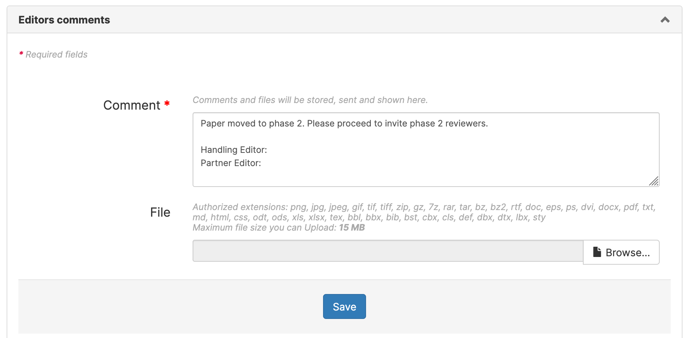

# TheoretiCS Helper for Editors-in-chief

> Authors: Antoine Amarilli, Nathanaël Fijalkow

This document is intended for TheoretiCS editors-in-chief to present the workflow of the
journal, which is a two-phase process. If you want a quick reference of the
workflow, have a look at the flowcharts for [phase 1](detailed-phase1.pdf) and [phase 2](detailed-phase2.pdf).

## Some terminology and basic actions

We first present a terminological note, and information about the two basic
tasks of accessing papers and writing comments.

### Terminology

The journal is hosted by the journal platform Episciences. Some of the
terminology used by the platform is unusual. For instance, a "rating" on the
platform is simply a review.

### Accessing papers

The two most important places are the "Dashboard" and the "Article management" pages.

* The "Dashboard" can be found from the menu on the left.
The "Journal management" tab includes statistics on all papers visible by you.
Clicking on "Manage articles" gets you to the "Article management" page.
The "My assigned papers" tab contains papers you were assigned to as editor.
The "My submissions" tab contains papers you submitted as author.
The "My account" tab lists all your privileges.

* The "Article management" page can be accessed either through the Dashboard or directly from the menu on the left: "Journal" expands into a list including "Article management".
This page lists all of the papers visible by you.
Click on a title to access the paper's page. The first time you access a paper, you will have to declare whether you have a conflict of interest or not.

### Writing comments

You can discuss a paper with fellow editors by leaving comments on the paper's page.
Once you access a paper, scroll down to "Editors comments" to see the comments and write one.

Posted comments are notified by email to the editors assigned to the paper.

Please avoid discussing papers outside of the Episciences system -- it's better
if all information about papers can be centralized on the platform where all
editors and editors-in-chief can access it.

## Following the workflow

We now give a step-by-step explanation of the flowcharts for [phase 1](detailed-phase1.pdf) and [phase 2](detailed-phase2.pdf).

### Authors: submit an article

Authors first submit their work on a repository (HAL or arXiv), and then submit
the paper to the Episciences system.

Authors who do not wish to submit their work to a repository when submitting to
the journal must get in touch with the editors-in-chief directly, so that their
paper can be handled outside the Episciences system.

Another case where the paper should be directly submitted to the
editors-in-chief is for submissions which are in conflict with one of the
editors-in-chief or managing editors (or directly done by them).

### Editors-in-chief or managing editors: assign to the volume "Phase 1"

We should ensure the article is moved to the volume "Phase 1". Ideally the first person accessing the article should do this. If we fail to do this, and it happens to go out to review, the wrong rating grid will be used. 

To do this, scroll down to the "Volumes and section" tab and change "Master volume" to "Phase 1"

### Editors-in-chief: quickly evaluate

* Access the paper (see above)
* The first task with recently submitted papers is to quickly evaluate them.
Click on the paper to access all information. The link for downloading the paper is highlighted in red in the picture below.

Judge if the publication process should proceed further or not. If not, reject the article: scroll down to the "Article status" tab and click on "Change article status" then option "Reject this article" (highlighted in red)

### Editors-in-chief: assign handling and partner editors

The second task is to Scroll down to the "Editors" tab and click on "Assign editors" to select two editors.

If the author has suggested an editor you will see their suggestion here. The editor may or may not be suitable based on workload or COI.

At this point there is no distinction between Handling and Partner Editor, but
try to assign first the handling editor and then the partner editor (the order
is kept by the system).

### Editors-in-chief: update the Google Sheet

* indicate roles (handling / partner)
* mark these yellow if not yet requested
* mark these grey if requested but not yet accessed
* clear colouring after request

### Editors-in-chief: write messages to the editors to indicate roles (handling / partner)

Then, you should send a message to the handling editor. To do this, click on the
mail icon next to their name in the "Editors" tab (highlighted in red below):

Change the subject and fill the message (see picture below), according to the text that follows, filling in the blanks NN, XX, YY, and ZZ, adding the date, and changing your signature:
 

<button onclick="copyDivToClipboard('msg-handling')">Copy handling editor
message to clipboard</button>

--------- VERSION FOR HANDLING EDITOR ------ 

 
Subject: TheoretiCS #NN: Handling editor 
 
I would like to ask you to act as handling editor for the following submission to TheoretiCS: 
 
Title: YY 
Authors: XX 
https://theoretics.episciences.org/administratepaper/view?id=ZZ 
 
Conference version appeared in: WW 
Deadline for the first phase: XX (10 weeks from submission date) 
Partner editor: XX 
 
<strong>Next steps:</strong> Please access the webpage of the submission by clicking on the link above; indicate that you do not have a COI, assuming this is the case; and start the reviewing process. (You can also access the paper by logging in to theoretics.episciences.org using your editor account, and then going to the "Dashboard".) 
 
You can discuss any action with your partner editor, and the two of you must agree on your final recommendations for phase 1 and for phase 2, if the paper reaches this stage. Please communicate with your partner editor through the system whenever possible by writing comments in the paper's page. Your partner editor receives the same emails as you from the system. 
 
<strong>First phase goals:</strong> Recall that TheoretiCS follows a two-phase reviewing process. In the first phase, you and your partner editor, usually after seeking the opinion of reviewers, agree on a recommendation: Move to the second phase of reviewing, or reject. The main criteria are the significance of the results, the belief that the exposition is of high quality or will be so after revision, and the availability of expert reviewers. In particular, detailed reviews are not necessarily required at this stage.  The recommendation then appears in the weekly digest and needs to be approved by the Editorial Board. 
 
If you haven't invited at least two reviewers to review the paper within two weeks, you will start to get automatic reminders. Notice that you can invite yourself and/or your partner editor to review the submission. 
 
Please conclude the first phase of reviewing before the deadline mentioned above. We promise the authors to do our best to finish the first phase of reviewing within 3 months. Thus, please consider the deadline above as a strict deadline, making sure we have enough time for discussions. Please consider evaluating the paper yourself, if needed. 
 
<strong>Second phase process:</strong> In the second phase, possibly different reviewers check the validity of the results and make suggestions to achieve a presentation of high quality. Submissions that qualify for the second phase are expected to eventually be accepted, sometimes in revised form, unless significant issues are detected or the desired quality of exposition is not achieved. 
 
We have step-by-step guidance for editors explaining our processes available here: <a href="https://nathanael-fijalkow.github.io/TheoretiCS_doc/editors.html">https://nathanael-fijalkow.github.io/TheoretiCS_doc/editors.html</a> If you have any difficulties with the system please feel free to ask the managing editors, David and Mikaël, either by posting an editors comment or via <a href="mailto:managing-editors@theoretics-journal.org">managing-editors@theoretics-journal.org</a>. 
 
Best regards,
Shuchi / Anca 
Editor-in-chief 
 

----------- END OF VERSION FOR HANDLING EDITOR --------- 

**Very important:** as a workaround to avoid [episciences issue
132](https://github.com/CCSDForge/episciences/issues/132#issuecomment-1005549895),
**refresh the page**. (Probably fixed.)

Now, do the same for the partner editor with the following message:

<button onclick="copyDivToClipboard('msg-partner')">Copy partner editor message to clipboard</button>

------------ VERSION FOR PARTNER EDITOR ------ 
  

 
Subject: TheoretiCS #NN: Partner editor 
 
I would like to ask you to act as partner editor for the following submission to TheoretiCS.  
 
Title: YY
Authors: XX
https://theoretics.episciences.org/administratepaper/view?id=ZZ
 
Conference version appeared in: WW 
Deadline for the first phase: XX (10 weeks from submission date) 
Handling editor: XX 
 
<strong>Next steps:</strong> Please access the webpage of the submission by clicking on the link above; indicate that you do not have a COI, assuming this is the case; and start the reviewing process. (You can also access the paper by logging in to theoretics.episciences.org using your editor account, and then going to the "Dashboard".) 
 
The handling editor is in charge of managing the review process, in collaboration with you, and you must make a joint recommendation. 
 
Please communicate with your partner editor through the system whenever possible by writing comments in the paper's page. Your partner editor receives the same emails as you from the system. 
 
<strong>First phase goals:</strong> Recall that TheoretiCS follows a two-phase reviewing process. In the first phase, you and the handling editor, usually after seeking the opinion of reviewers, agree on a recommendation: Move to the second phase of reviewing, or reject. The main criteria are the significance of the results, the belief that the exposition is of high quality or will be so after revision, and the availability of expert reviewers. The recommendation then appears in the weekly digest and needs to be approved by the Editorial Board. 
 
I have asked the handling editor to conclude this phase before the deadline mentioned above. We promise the authors to do our best to finish the first phase of reviewing within 3 months. Thus, please consider the deadline above as a strict deadline, making sure we have enough time for discussions. Please consider evaluating the paper yourself, if needed. 
 
<strong>Second phase process:< In the second phase, reviewers check the validity of the results and make suggestions to achieve a presentation of high quality. Submissions that qualify for the second phase are expected to eventually be accepted, sometimes in revised form, unless significant issues are detected or the desired quality of exposition is not achieved. 
 
We have step-by-step guidance for editors explaining our processes available here: <a href="https://nathanael-fijalkow.github.io/TheoretiCS_doc/editors.html">https://nathanael-fijalkow.github.io/TheoretiCS_doc/editors.html</a> If you have any difficulties with the system please feel free to ask the managing editors, David and Mikaël, either by posting an editors comment or via <a href="mailto:managing-editors@theoretics-journal.org">managing-editors@theoretics-journal.org</a>. 
 
Best regards,  
Shuchi / Anca 
Editor-in-chief 
 

----------- END OF VERSION FOR PARTNER EDITOR ------------

### Assigned editors: invite reviewers

The editors should now assign reviewers. As long as the number of assigned
reviewers is less than two, they will receive a reminder.

### Editors-in-chief: add a comment to announce the editors

You must wait for the assigned handling editor to react and confirm that
they can handle the submission, first by confirming (when accessing the
submission) that they have no conflict of interest with the submission, then by
performing their work of inviting reviewers (or indicating that they intend to
review the article themselves, by assigning themselves or writing a comment to
that effect). 
Once the editors have reacted, you do two things:
* write to the authors to let them know who are the assigned editors, and
* post a comment indicating again who the confirmed handling/partner editors are. 

To do the latter:
* Access the paper (using Dashboard, as above)
* Scroll down to the "Editors comments" tab and add a comment: "Handling Editor: XXX
Partner Editor: YYY
Deadline for recommendation: ZZZ"

If an editor has a conflict of interest with the paper, or decides not to handle
the paper, they will get unassigned from the article, and you will receive an
email message. If editors do not invite reviewers, they will receive automatic
reminders (see below). If editors do invite reviewers, the article status
changes to "Under review".

Note that, once an article is submitted, a weekly email digest will invite all
editors to comment on the submission. Comments will trigger an
email notification to the assigned editors (and only them). It is up to the
assigned editors to contact the editors-in-chief if something unexpected arises
based on the comments.

### Editors: take care of the review process for Phase 1

The editors assigned to the article (handling and partner) now take care of
inviting reviewers, etc.

Once the editors have invited reviewers, the paper goes to status "Waiting for
reviewing". Once they have accepted invitations, the paper goes to status "Under
review". With these two last statuses, the paper is waiting for actions from the
reviewers (but the editors should make sure that the reviewers react). Once all
pending reviews are completed, the paper goes back to status "Reviewed" and it
is up to the editor to manage it.

The editors-in-chief should keep an eye on papers assigned to editors, reminding
them to invite reviewers ("Submitted"), to check acceptance of reviewer invitations
("Waiting for reviewing"), to ensure that their reviewers complete their work
in time ("Under review"), or to make a recommendation ("Reviewed").

Once this is done (the paper has status "Reviewed" and the editors do not wish
any more reviews), the editors can propose a decision. For phase 1, this is:
propose to accept, or propose to reject (no revision possible).

Once the editors have proposed a verdict, a weekly digest will invite all
editors to comment on the article. Once this period has elapsed, the editors-in-chief
communicate the decision to the authors.

During all that process, the paper remains in status "Reviewed".

### Editors-in-chief: communicate decision of Phase 1 to the authors

To communicate the decision to the authors:

* Access the paper (using Dashboard, as above)

Then, the process depends on the outcome for the article

#### The article should be rejected

To reject the article:

* Scroll down to the "Article status" tab and click on "Change article status" then option "Reject this article" (highlighted in red)

#### The article should be moved to Phase 2, but expecting a revision from the authors

* Move the paper to phase 2: scroll down to the "Volumes and section" tab and change "Master volume" to "Phase 2":

* Scroll down to the "Editors comments" tab and add a comment: "Moving the paper to Phase 2. A revision has been asked to start phase 2."

* Scroll down to the "Article status" tab and click on "Ask for a minor
revision" (highlighted in red), or "Ask for a major revision", depending on the
revision needed

* Replace the text with the message below, changing NN, XX, YY and your signature in the message.

**Do not forget to change the subject of the message!**

<button onclick="copyDivToClipboard('msg-phase1-accept-revision')">Copy phase 1 acceptance message to clipboard</button>

----------- BEGINNING OF EMAIL ------------ 
 
Subject: TheoretiCS #NN: Phase 1 results and request for revision 
 
Title: XX 
 
Dear Author: 
 
I am very happy to inform you that your paper has successfully passed the first phase of our review process. This means that the Editorial Board considers the results of your paper significant and of lasting value. The referee reports are attached.  
 
Before starting the second phase of the review process, we would like you to revise your paper to incorporate the comments of the phase 1 reviewers. In particular, please fix: YY 
 
We ask you to revise your paper
  
*** within 1 month ***
  
Please also send me a detailed response to the referee reports.
  
To submit your revised version, you can click "Answer this request" -> "Send a temporary version", and submit the new version of your paper, together with the response to the referee reports and additional files if needed. Alternatively, if you prefer, you can update your article on arXiv and select "Answer this request" -> "Upload a new version".
 
 
With best regards, 
Uri / Anca 
Editor-in-Chief 
 
----------- END OF EMAIL ------------ 

You can optionally set a deadline for the revision request. Do *not* tick the "Automatically reinvite reviewers" checkbox.

The paper now still have status "Pending major revision" or "Pending minor revision".

Once the authors submit a new version, the editors will be able to invite
reviewers from Phase 2 (manually).
The old reviews and reviewers can be found by looking at the "Versions" tab of the article's page.

#### The article should be moved to Phase 2 without any modification

To conditionally accept (move to Phase 2) and send the reviews to the authors, without expecting a revision from them, the process
is more complicated. It is the same as the above process, but then spoofing the identity of the authors to submit a new version without any changes. Specifically:

* Move the paper to phase 2: scroll down to the "Volumes and section" tab and change "Master volume" to "Phase 2":
* Scroll down to the "Article status" tab and click on "Ask for a minor revision" (highlighted in red)

* Replace the text with the message below, changing NN, XX, and your signature in the message.

**Do not forget to change the subject of the message!**

<button onclick="copyDivToClipboard('msg-phase1-accept')">Copy phase 1 acceptance message to clipboard</button>

----------- BEGINNING OF EMAIL ------------ 
 
Subject: TheoretiCS #NN: Phase 1 results 
 
Title: XX 
 
Dear Author: 
 
I am very happy to inform you that your paper has successfully passed the first phase of our review process. This means that the Editorial Board considers the results of your paper significant and of lasting value. The referee reports are attached.  
 
The paper will now undergo a thorough review to check the correctness of the results and the exposition. You are not expected to react to the referee reports at this stage. 
 
With best regards, 
Uri / Anca 
Editor-in-Chief 
 
----------- END OF EMAIL ------------ 

* Scroll up to the "Contributor" tab and click on the third button (highlighted in red) to spoof the identity of the author

* Access the paper (using Dashboard, as above)
* Download the article from arXiv by clicking on the link after "Source:" and then clicking "Download: PDF" on arXiv.
* Scroll down to the "Revision requests" tab and click on "Answer this request" and "Send a temporary version"
* Edit the form: click "Add files...", attach the paper downloaded from arXiv. Leave the "Comment" field empty.
* Click "Submit". You will see the message "Your temporary version has been saved"
* Log out, and log in again with your usual account
* Navigate back to the administration page for the paper (the most convenient is
  to do this with the browser history)
* Make sure to access the latest version of the article: if the article has "Current status: Obsolete", follow the link in "Please note that this article is obsolete.
    It is an older version of this article". Then, if you do not have the options to change the article status, click "Go to the management page for this article".

* Scroll down to the "Editors comments" tab and add a comment: 

Paper moved to phase 2. Please proceed to invite phase 2 reviewers. 
 
Handling Editor:  
Partner Editor:

The paper will now have status "Submitted", and the editors should take care of it by inviting reviewers (manually).
The old reviews and reviewers can be found by looking at the "Versions" tab of the article's page.

### Editors: take care of the review process for Phase 2

The editors assigned to the article (handling and partner) now take care of
inviting reviewers, etc. As previously, the paper goes to status "Waiting for
reviewing" once reviewers have been invited, goes to "Under review" when
invitations were accepted, and goes to "Reviewed" once the reviews are completed.

Once this process is finished, the editors can propose a decision. 
For phase 2, this is: propose to accept, propose to reject, ask for minor revisions, or ask for major revisions.

Revision requests are dealt with directly by the editors, without intervention from the editors-in-chief.

Once the editors have proposed a final verdict (acceptance or rejection), a weekly digest will invite all
editors to comment on the article. Once this period has elapsed, the editors
should communicate the decision to the authors.

### Editors-in-chief: communicate decision of Phase 2 to the authors

To communicate the decision to the authors:

* Access the paper (using Dashboard, as above)

To accept: 

* Scroll down to the "Article status" tab and click on "Change article status" to "Accept and proceed to copy editing" (example highlighted in red) or "Ask for final version".  (Which option is displayed depends on whether the current version corresponds with an arXiv version or is a temporary version, only saved in the episciences system.)
* Ensure the subject is suitable (e.g. TheoretiCS #XXXXX - Your article has been accepted).
* The email does not ask for the sources, the managing editors will send a second email asking for the sources. Please ensure they are informed.

To reject:
* Scroll down to the "Article status" tab and click on "Change article status"  and select "Reject this article" (highlighted in red)

If accepted, the paper then proceeds to the layout editing phase for final
publication.

## Publication process (for managing editors)

See [guide for managing editors here.](beyond-acceptance.html)

## Special workflow for conflicted papers

### Papers authored by an editor-in-chief

This case will not happen; editors-in-chief are not allowed to submit papers to
the journal.

### Papers authored by a managing editor

Papers authored by a managing editor are submitted to the system as usual, and
handled by an editor-in-chief, who assigns editors, and posts a comment saying
that there should be no discussion about the paper on the system.

The paper is advertised as a new submission in the digest, and it is said there
that the paper will not be discussed on the platform, and that editors who would
want to comment (or be Cc'd to the discussion) should contact the relevant
editor-in-chief by email.

The editors handle reviewing and discussion between themselves and the
editor-in-chief by email.

The acceptance/rejection proposition is not put on the platform but sent in a
"shadow digest" by the editor-in-chief directly to all editors.

When the paper moves forward to phase 2, is revised, etc., these changes are
implemented on Episciences by the editors-in-chief; but discussion never happens
on Episciences.

(The rationale for all of this is that there is currently no way to hide from
managing editors the information of what happens on the platform.)

### Papers authored by editors

Papers authored by an editor are handled in the normal way (and the editor in
question should be in COI with the paper on Episciences), the only difference is
that we make sure not to include confidential information about the paper in the
digest.

For this, the EiCs should notice when a submitted paper has an editor among the
authors (editors can also point this out to the EiCs, in the cover letter...).
Then, managing editors mark the paper as "authored by an editor". For such
papers, in the digest, we do not include any confidential information, e.g., we
write "A verdict was proposed for this paper, but since it is authored by an
editor, you can only see it by clicking the link...".

### Papers in conflict with an editor-in-chief or managing editor

These papers are managed normally. We trust editors-in-chief and managing
editors not to be involved with the paper and not looking at what goes on with
the paper.

### Papers in conflict with an editor

These papers are managed normally. We think it is not a problem if editors can
see in the digest some information about papers that they are conflicted with.

If an editor has such a strong conflict that they would like to make sure that
they don't see information in the digest about the paper, they can write the
EiCs so that the paper is marked as "authored by an editor" and we apply the
above procedure.

## Useful links

* General-purpose [Episciences documentation](https://doc.episciences.org/en/welcome/).
* [Issue tracker for Episciences](https://github.com/CCSDForge/episciences/issues)

