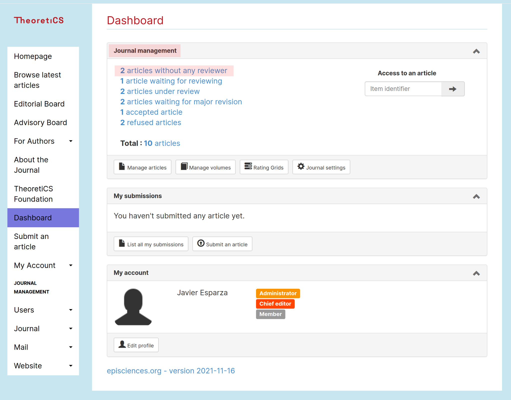
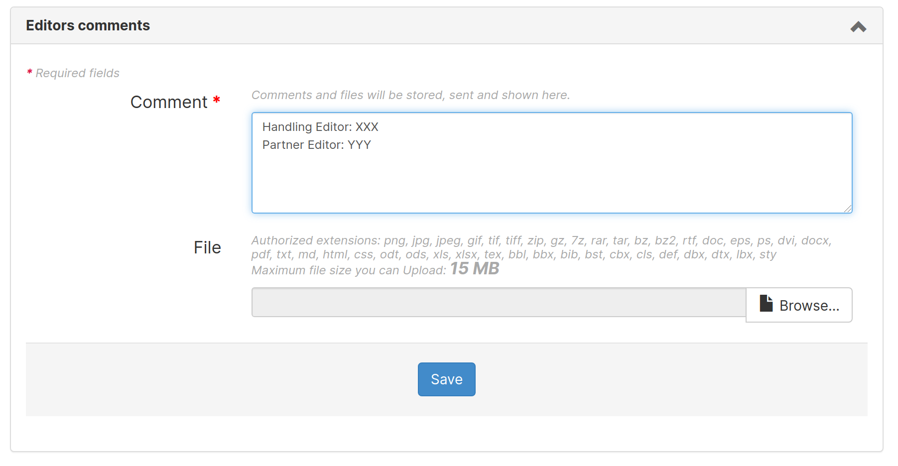

# TheoretiCS Helper for Editors in Chief

## Nathanaël Fijalkow, Antoine Amarilli

### Authors: submit

The submission must be on Arxiv or HAL to be handled by the system.
Please contact the Editors-in-Chief directly if you wish to submit a paper without sending it to Arxiv.

### Editors in chief: quickly evaluate

* Access the dashboard

* Freshly submitted papers are in "articles without any reviewer" in the "Journal management" tab (both highlighted in red)

* At the bottom of the page, the list of papers includes all papers which have status "Submitted"

### Editors in chief: quickly evaluate

Click on the paper to access all information. The link for downloading it is highlighted in red

To reject: scroll down to the "Article status" tab and use the button highlighted in red

### Editors in chief: assign to the volume "Phase 1"

Scroll down to the "Volumes and section" tab and change "Master volume" to "Phase 1"

### Editors in chief: assign handling and partner editors

Scroll down to the "Editors" tab and click on "Assign editors" to select two editors (at this point there is no distinction between Handling and Partner Editors)

### Editors in chief: write messages to the editors to indicate roles (handling / partner)

To send the following message to the handling editor:

* Access the mailing in "Mail" menu

* Copy the message below

--------- VERSION FOR HANDLING EDITOR ------

Subject: TheoretiCS #**N**: Handling editor

TITLE: **XX**

Dear **YY**:

I would like you to act as handling editor of the above submission to TheoretiCS. 

Please login to your editor accounts to start the review process.
Click on "Dashboard" and then on the title of the paper to access
the paper's page.

Your partner editor is **ZZ**. You can discuss any action with your partner editor,
and the two of you must agree on your final recommendation (see below).

Please communicate with your partner editor through the system if at all
possible, either by writing comments in the paper's page or by
email (click on the mail icon to the right of the name of the editor in the
paper's page). Your partner editor receives the same emails as you from the system.

If you haven't assigned at least two reviewers to the paper within two weeks you 
will start to get automatic reminders. Notice that you can 
assign yourself and/or your partner editor.

Recall that TheoretiCS follows a two-phase reviewing process. 
In the first phase, you and your partner editor, usually after seeking the opinion 
of reviewers, agree on a recommendation: Accept for the second phase, or reject.
The main criteria are the significance of the results, the belief that the exposition 
is of high quality or will be so after revision, and the availability of expert reviewers. 
The paper moves to the second phase after approval by the Editorial Board. 

I would like to ask you to conclude this first phase before

** Date (about current date + 10 weeks) **

In the second phase, possibly different reviewers check the validity of the results and the
presentation. Submissions that pass the first phase are expected to eventually be 
published, sometimes in revised form, unless significant issues are detected or the desired 
quality of exposition is not achieved.

Best regards, Uri/Javier
Editor in chief

----------- END OF VERSION FOR HANDLING EDITOR ---------

Repeat the operation to send the message below to the partner editor

------------ VERSION FOR PARTNER EDITOR ------

Subject: TheoretiCS #**N**: Partner editor

TITLE: **XX**

Dear **YY**:

I would like you to act as partner editor of the above submission to TheoretiCS. 
The handling editor, **ZZ**, is in charge of conducting the review process,
in collaboration with you, and you must make a joint recommendation. 

To access the paper, log into your editor account,
click on "Dashboard", and then on the title of the paper.

Recall that TheoretiCS follows a two-phase reviewing process. 
In the first phase, you and your partner editor, usually after seeking the opinion 
of reviewers, agree on a recommendation: Accept for the second phase, or reject.
The main criteria are the significance of the results, the belief that the exposition 
is of high quality or will be so after revision, and the availability of expert reviewers. 
The paper moves to the second phase after approval by the Editorial Board.

I have asked the handling editor to conclude this phase before

** Date (about current date + 10 weeks) **

In the second phase, reviewers check the validity of the results and make suggestions 
to achieve a presentation of high quality. Submissions that qualify for the second 
phase are expected to eventually be published, usually in revised form, unless 
significant issues are detected or the desired quality of exposition is not achieved.

Best regards, Uri/Javier
Editor in chief

----------- END OF VERSION FOR PARTNER EDITOR ------------

### Assigned editors: invite reviewers

Triggers: 

### Editors in chief: add a comment to announce the editors

* Access the paper (using Dashboard, as above)

* Scroll down to the "Editors comments" tab and add a comment

