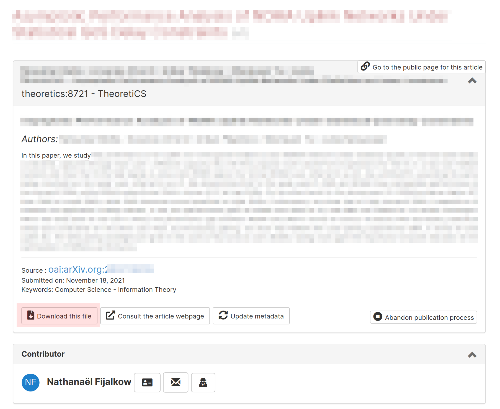

# TheoretiCS Helper for Editors in Chief

> Authors: Antoine Amarilli, Nathanaël Fijalkow

This document is intended for TheoretiCS editors in chief to present the workflow of the
journal, which is a two-phase process. If you want a quick reference of the
workflow, have a look at the flowchart for [phase 1](detailed-phase1.pdf) and [phase 2](detailed-phase2.pdf).

### Authors: submit an article

Authors first submit their work on a repository (HAL or arXiv), and then submit
the paper to the Episciences system.

Authors who do not wish to submit their work to a repository when submitting to
the journal must get in touch with the Editors in chief directly, so that their
paper can be handled outside the Episciences system.

Another case where the paper should be directly submitted to the
Editors in chief is for submissions which are in conflict with one of the
Editors in chief or managing editors (or directly done by them).

### Editors in chief: quickly evaluate

* First access the Dashboard


* To list recently submitted papers, in the Dashboard, click on in "articles without any reviewer" in the "Journal management" tab (both highlighted in red in the picture below)


* This leads you to the "Manage articles" page. The papers are listed at the
  bottom of the page, and have status "Submitted".

* The first task with recently submitted papers is to quickly evaluate them.
Click on the paper to access all information. The link for downloading the paper is highlighted in red in the picture below.



Judge if the publication process should proceed further or not. If not, reject the article: scroll down to the "Article status" tab and click on "Change article status" then option "Reject this article" (highlighted in red)


### Editors in chief: assign to the volume "Phase 1"

If the publication process should continue, the first task is to assign
the article to Phase 1. To do this, scroll down to the "Volumes and section" tab and change "Master volume" to "Phase 1"


### Editors in chief: assign handling and partner editors

The second task is to Scroll down to the "Editors" tab and click on "Assign editors" to select two editors.
At this point there is no distinction between Handling and Partner Editor, but
try to assign first the handling editor and then the partner editor (the order
is kept by the system).


### Editors in chief: write messages to the editors to indicate roles (handling / partner)

Then, you should send a message to the handling editor. To do this, click on the
mail icon next to their name in the "Editors" tab (highlighted in red below):


Change the subject and fill the message (see picture below), according to the text that follows, filling in the blanks NN, XX, YY, and ZZ, adding the date, and changing your signature:
 


```
--------- VERSION FOR HANDLING EDITOR ------

Subject: TheoretiCS #**NN**: Handling editor

TITLE: **XX**

Dear **YY**:

I would like you to act as handling editor of the above submission to TheoretiCS. 

Please login to your editor accounts to start the review process.
Click on "Dashboard" and then on the title of the paper to access
the paper's page.

Your partner editor is **ZZ**. You can discuss any action with your partner editor,
and the two of you must agree on your final recommendation (see below).

Please communicate with your partner editor through the system if at all
possible, either by writing comments in the paper's page or by
email (click on the mail icon to the right of the name of the editor in the
paper's page). Your partner editor receives the same emails as you from the system.

If you haven't assigned at least two reviewers to the paper within two weeks you 
will start to get automatic reminders. Notice that you can 
assign yourself and/or your partner editor.

Recall that TheoretiCS follows a two-phase reviewing process. 
In the first phase, you and your partner editor, usually after seeking the opinion 
of reviewers, agree on a recommendation: Accept for the second phase, or reject.
The main criteria are the significance of the results, the belief that the exposition 
is of high quality or will be so after revision, and the availability of expert reviewers. 
The paper moves to the second phase after approval by the Editorial Board. 

I would like to ask you to conclude this first phase before

** Date (about current date + 10 weeks) **

In the second phase, possibly different reviewers check the validity of the results and the
presentation. Submissions that pass the first phase are expected to eventually be 
published, sometimes in revised form, unless significant issues are detected or the desired 
quality of exposition is not achieved.

With best regards, 
Uri / Javier
Editor in chief

----------- END OF VERSION FOR HANDLING EDITOR ---------
```

Now, do the same for the partner editor with the following message:

```
------------ VERSION FOR PARTNER EDITOR ------

Subject: TheoretiCS #**NN**: Partner editor

TITLE: **XX**

Dear **YY**:

I would like you to act as partner editor of the above submission to TheoretiCS. 
The handling editor, **ZZ**, is in charge of conducting the review process,
in collaboration with you, and you must make a joint recommendation. 

To access the paper, log into your editor account,
click on "Dashboard", and then on the title of the paper.

Recall that TheoretiCS follows a two-phase reviewing process. 
In the first phase, you and your partner editor, usually after seeking the opinion 
of reviewers, agree on a recommendation: Accept for the second phase, or reject.
The main criteria are the significance of the results, the belief that the exposition 
is of high quality or will be so after revision, and the availability of expert reviewers. 
The paper moves to the second phase after approval by the Editorial Board.

I have asked the handling editor to conclude this phase before

** Date (about current date + 10 weeks) **

In the second phase, reviewers check the validity of the results and make suggestions 
to achieve a presentation of high quality. Submissions that qualify for the second 
phase are expected to eventually be published, usually in revised form, unless 
significant issues are detected or the desired quality of exposition is not achieved.

With best regards, 
Uri/Javier
Editor in chief

----------- END OF VERSION FOR PARTNER EDITOR ------------
```

### Assigned editors: invite reviewers

The editors should now assign reviewers. As long as the number of assigned
reviewers is less than two, they will receive a reminder.

### Editors in chief: add a comment to announce the editors

You must wait for the assigned handling editor to react and confirm that
they can handle the submission, first by confirming (when accessing the
submission) that they have no conflict of interest with the submission, then by
performing their work of inviting reviewers (or indicating that they intend to
review the article themselves, by assigning themselves or writing a comment to
that effect). Once the editors have reacted, you can post a comment indicating
again who the confirmed handling/partner editors are. To do this:
* Access the paper (using Dashboard, as above)
* Scroll down to the "Editors comments" tab and add a comment: "Handling Editor: XXX
Partner Editor: YYY"


If an editor has a conflict of interest with the paper, or decides not to handle
the paper, they will get unassigned from the article, and you will receive an
email message. If editors do not invite reviewers, they will receive automatic
reminders (see below). If editors do invite reviewers, the article status
changes to "Under review".

Note that, once an article is submitted, a weekly email digest will invite all
editors will be invited to comment on the submission. Comments will trigger an
email notification to the assigned editors (and only them). It is up to the
assigned editors to contact the Editors in chief if something unexpected arises
based on the comments.

### Editors: take care of the review process for Phase 1

The editors assigned to the article (handling and partner) now take care of
inviting reviewers, etc.

Once the editors have invited reviewers, the paper goes to status "Waiting for
reviewing". Once they are accepted invitations, the paper goes to status "Under
review". With these two last statuses, the paper is waiting for actions from the
reviewers (but the editors should make sure that the reviewers react). Once all
pending reviews are completed, the paper goes back to status "Reviewed" and it
is up to the editor to manage it.

Once this is done (the paper has status "Reviewed" and the editors do not wish
any more reviews), the editors can propose a decision. For phase 1, this is:
propose to accept, or propose to reject (no revision possible).

Once the editors have proposed a verdict, a weekly digest will invite all
editors to comment on the article. Once this period has elapsed, the editors
should communicate the decision to the authors.

During all that process, the paper remains in status "Reviewed".

### Editors in chief: communicate decision of Phase 1 to the authors

To communicate the decision to the authors:

* Access the paper (using Dashboard, as above)

To reject: 

* Scroll down to the "Article status" tab and click on "Change article status" then option "Reject this article" (highlighted in red)


To conditionally accept (move to Phase 2) and send the reviews to the authors,
the process is more complicated:

* Scroll down to the "Article status" tab and click on "Ask for a minor revision" (highlighted in red)


* Replace the text with the message below, changing NN, XX, and your signature in the message.

```
----------- BEGINNING OF EMAIL ------------

Subject: TheoretiCS #**NN**: Phase 1 results

Title: **XX**

Dear Author:

I am very happy to inform you that your paper has 
successfully passed the first phase of our review process. 
This means that the Editorial Board considers the results of 
your paper significant and of lasting value. 
The referee reports are attached. 

The paper will now undergo a thorough review to check the 
correctness of the results and the exposition. You are not
expected to react to the referee reports at this stage.

With best regards,
Uri / Javier
Editor-in-Chief

----------- END OF EMAIL ------------
```

* Scroll up to the "Contributor" tab and click on the third button (highlighted in red) to spoof the identity of the author


* Access the paper (using Dashboard, as above)
* Scroll down to the "Revision requests" tab and click on "Answer this request" and "Answer without any modifications" (highlighted in red)


* Validate the form with a dummy message, e.g., "The article has been accepted
  to phase 2, the assigned editors should now invite phase 2 reviewers"
* Log out, and log in again with your usual account
* Navigate back to the administration page for the paper (the most convenient is
  to do this with the browser history)
* Move the paper to phase 2: scroll down to the "Volumes and section" tab and change "Master volume" to "Phase 2":


* Scroll down to the "Editors comments" tab and add a comment: "Moving the paper to Phase 2."


The paper now still have status "Reviewed".

### Editors: take care of the review process for Phase 2

The editors assigned to the article (handling and partner) now take care of
inviting reviewers, etc. As previously, the paper goes to status "Waiting for
reviewing" once reviewers have been invited, goes to "Under review" when
invitations were accepted, and goes to "Reviewed" once the reviews are completed.

Once this process is finished, the editors can propose a decision. 
For phase 2, this is: propose to accept, propose to reject, ask for minor revisions, or ask for major revisions.

Revision requests are dealt with directly by the editors, without intervention from the Editors in chief.

Once the editors have proposed a final verdict (acceptance or rejection), a weekly digest will invite all
editors to comment on the article. Once this period has elapsed, the editors
should communicate the decision to the authors.

### Editors in chief: communicate decision of Phase 2 to the authors

To communicate the decision to the authors:

* Access the paper (using Dashboard, as above)

To accept or reject: 

* Scroll down to the "Article status" tab and click on "Change article status" to "Accept and proceed to copy editing" or "Reject this article" (both highlighted in red)


If accepted, the paper then proceeds to the layout editing phase for final
publication.

