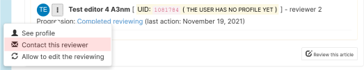

# TheoretiCS Helper for Editors

> Authors: Antoine Amarilli, Nathanaël Fijalkow

This document is intended for TheoretiCS editors to present the workflow of the
journal, which is a two-phase process. If you want a quick reference of the
workflow, have a look at the flowcharts for [phase 1](editors-phase1.pdf) and [phase 2](editors-phase2.pdf).

## Some terminology and basic actions

We first present a terminological note, and information about the two basic
tasks of accessing papers and writing comments.

### Terminology

The journal is hosted by the journal platform Episciences. Some of the
terminology used by the platform is unusual. For instance, a "rating" on the
platform is simply a review.

The "weekly digest" email is a summary that will be sent weekly (hence the name)
to all editors to inform them about papers that were just submitted and papers
which are about to be accepted or rejected.

### Accessing papers

The two most important places are the "Dashboard" and the "Article management" pages.

* The "Dashboard" can be found from the menu on the left.
The "Journal management" tab includes statistics on all papers visible by you.
Clicking on "Manage articles" gets you to the "Article management" page.
The "My assigned papers" tab contains papers you were assigned to as editor.
The "My submissions" tab contains papers you submitted as author.
The "My account" tab lists all your privileges.


* The "Article management" page can be accessed either through the Dashboard or directly from the menu on the left: "Journal" expands into a list including "Article management".
This page lists all of the papers visible by you.
Click on a title to access the paper's page. The first time you access a paper, you will have to declare whether you have a conflict of interest or not.


### Participating in the selection process

There are two ways editors can participate in the editorial process of each paper:
* as assigned editors to the paper, either as handling editor (main) or partner
  editor,
* as an external editor: in particular when informed by the weekly digest email

### Writing comments

You can discuss a paper with fellow editors by leaving comments on the paper's page.
Once you access a paper, scroll down to "Editors comments" to see the comments and write one.


Posted comments are notified by email to the editors assigned to the paper.

Please avoid discussing papers outside of the Episciences system -- it's better
if all information about papers can be centralized on the platform where all
editors and editors-in-chief can access it.

## Following the workflow

### Authors: submit an article

Authors first submit their work on a repository (HAL or arXiv), and then submit
the paper to the Episciences system.

Authors who do not wish to submit their work to a repository when submitting to
the journal must get in touch with the Editors-in-chief directly, so that their
paper can be handled outside the Episciences system.

Another case where the paper should be directly submitted to the
Editors-in-chief is for submissions which are in conflict with one of the
Editors-in-chief or managing editors (or directly done by them).

### Editors-in-chief: quickly evaluate

The Editors-in-chief can decide to reject the paper directly. If they do not,
the paper starts in Phase 1.

### Editors-in-chief: assign handling and partner editors

The Editors-in-chief assign two editors: handling and partner.

### Editors: declare (absence of) conflict of interest

* Access the paper (see above)
* The first time you access a paper you have to declare whether you have a conflict of interest or not


If you have a conflict of interest, you will not be able to access any
information about this paper anymore. In particular, if you had been assigned as
handling editor or partner editor to this paper, you will be automatically
unassigned.

To know what constitutes a conflict of interest, please refer to the [conflict
of interest
policy](https://theoretics.episciences.org/page/conflict-of-interest-policy). If
you are still unsure, please contact the Editors-in-chief.

If you mistakenly indicate that you have a conflict of interest with a
submission, you need to get in touch with the Editors-in-chief, who will write
to the Episciences administrators to reset this.

### Assigned editors: invite reviewers

You should now assign reviewers. As long as the number of assigned reviewers is less than two, you will receive a reminder.

Scroll down to "Reviewers" and click on "Invite a reviewer" to invite a reviewer,
or on "Review this article" if you plan on reviewing it yourself.


There are two possibilities:
* Either the reviewer has already reviewed for TheoretiCS. If so, you can simply
  select them from the list: "Filter reviewers"

* Or the reviewer has never reviewed for TheoretiCS, click on "New reviewer" on the bottom right.
Please check whether the reviewer has an Episciences account by searching for them in "Invite a known user",
otherwise fill in the email / name / first name fields in "Invite a new user".


When inviting a reviewer, you have to complete an email message. The email is
pre-filled with text, but you have to retain the text for the right phase. In
phase 1, keep the text that says "Phase 1", along with the signature. You should
also set a deadline for the review, both above the "Subject" field, and in the
text of the email (highlighted in red below).


Please pick a deadline for the review that allows for the first phase to
complete within three months: the submission date of paper is accessible on its
page (look for "Submitted on"). Please keep in mind that once all reviews are received
you need to make a decision on the paper, all editors should have one week of
time to discuss it, and then the Editors-in-chief will have to implement it. For
this reason, please keep a safety buffer of at least two weeks before the three
months deadline.

It is normal for the email to contain text "%%INVITATION_URL%%". This will be
automatically filled by the system when the email is sent.

Once you have invited reviewers, the paper goes to status "Waiting for
reviewing". Once they have accepted invitations, the paper goes to status "Under
review". With these two last statuses, the paper is waiting for actions from the
reviewers (but you should keep an eye on reviewers, to make sure that they react
to the invitation, and that they hand in the reviews on time). Once all
pending reviews are completed, the paper goes to status "Reviewed" and it
is up to you to propose a decision.

### Assigned editors: propose decision

Once the paper has status "Reviewed" and you do not wish any more reviews, you can propose a decision. 
For phase 1, this is: propose to accept or propose to reject (no revision possible).
Please do not use the revision mechanism at this stage: it is supported by the
platform, but in the TheoretiCS workflow we want to give authors a definitive
answer within three months.


Once you have proposed a decision, a weekly digest will invite all editors to comment on the article. 
Once this period has elapsed, the Editors-in-chief communicate the decision to the authors.

During all that process, the paper remains in status "Reviewed" and is in phase 1.

### Editors-in-chief: communicate decision of Phase 1 to the authors

The Editors-in-chief send the reviews to the authors and move the paper to
phase 2. This will always be done by the Editors-in-chief -- do not move a
paper to phase 2 yourself!

### Assigned editors: take care of the review process for Phase 2

Once the paper has been moved to phase 2 by the Editors-in-chief and is in status
"Reviewed", you can now invite reviewers again.

#### Reinviting a Phase 1 reviewer

One possibility is to invite the phase 1 reviewers to serve as phase 2
reviewers. Note that the reviewing form filled by the reviewers includes a field
"Would you be available for a second-phase review?" (which is visible to the
editors but not to the authors). If you wish to do this, you should first go the
the "Reviewers" tab on the articles page, then click the menu next to the
reviewer's name, and select "Allow to edit the reviewing" (see image below).


You should then send an email to the reviewer, clicking on "Contact this
reviewer".



Here is a template that you can use, filling in the blanks NN, XX, YY, ZZ:

```
NUMBER : #**NN**
TITLE : **XX**

Dear **YY**,

The paper above has been submitted for publication in the open-access electronic
journal TheoretiCS, and you had served as a reviewer for the first phase of the
TheoretiCS review process.

The paper has been accepted after the first phase: the Editorial Board thinks it
contains significant results of lasting value, worthy of being inspected in more
detail to check their correctness and the quality of the presentation.

I would greatly appreciate it if you could act as a referee for the second phase. The deadline for your review is:

**ZZ**

You can complete your review directly by going to your Episciences profile and
editing your previous reviewing. Remember that you can log in to TheoretiCS with
your CCSD identifier (this identifier is shared by CCSD services, such as HAL,
Episciences...). Once you have completed your review, you should complete the
"Phase 2" part of the review form. Please do not edit the "Phase 1" part of the
form.

Please let me know today, if at all possible, whether you will be able to
provide a review or not, by replying to this email.
```

It is very important that you send the email, because reviewers will *not* be
notified automatically when you click "Allow to edit the reviewing". Also, the
Episciences system does not manage a deadline or reminders once you have allowed
to edit the reviewing. Once the reviewer confirms acceptance of the invitation,
*please post a comment* on the article page to clarify that they accepted and
what the deadline is, so other editors and the Editors-in-Chief can see it.

#### Inviting a Phase 2 reviewer

Reviewing a paper for phase 1 does not commit reviewers to accepting to serve on
phase 2, so it is possible to invite new reviewers for phase 2. To do so, simply
follow the same steps as in phase 1.

#### What to do after sending the invitations

As previously, the paper goes to status "Waiting for reviewing" once reviewers have been invited, goes to "Under review" when invitations were accepted, and goes to "Reviewed" once the reviews are completed.

Once this process is finished, you can propose a decision. 
For phase 2, this is: propose to accept, propose to reject, ask for minor revisions, or ask for major revisions.

Revision requests are dealt with directly by you, without intervention from the Editors-in-chief.

### Revision requests

Please remember that revisions should only be used in Phase 2, not in phase 1!

When you request a revision on a paper, you are asked to compose a message to
the authors:


Please do not forget to remove the reminder text in caps (highlighted in red
above). You can optionally set a deadline for the revision request.

One important checkbox is "Automatically reinvite reviewers" (at the bottom).
The justification for this box is that every revision of a paper is a different
paper in the Episciences platform. More precisely, authors "revise" their paper
by submitting a new version of their submission on arXiv, and then importing it
in the Episciences platform. The platform creates a new paper (with a new ID)
for each arXiv version of a paper (but the papers are linked, i.e., the old
versions of the paper will point to the latest version). Each paper version on
the platform has its own set of reviewers.

If the "Automatically reinvite reviewers" checkbox is not checked, once the
authors submit a revision, you will have to manually re-invite the right
reviewers on the new version of their paper.

If the checkbox is checked, all reviewers from the current version of the paper
will automatically be re-invited. This can only be used if all reviewers on the
paper are willing to re-review the paper. In particular, it cannot be used if
some of these reviewers only reviewed the paper for phase 1.

Hence, before ticking this box, please check that all reviewers currently listed
in the "Reviewers" tab are indeed Phase 2 reviewers who are willing to see the
revised version. When in doubt, it is better to not tick the box and reinvite
reviewers manually.

### Final verdict

Once you have proposed a final verdict (acceptance or rejection), a weekly digest will invite all
editors to comment on the article. Once this period has elapsed, the Editors-in-chief communicate the decision to the authors.

## Getting help

Email the [managing editors: Antoine Amarilli and Nathanaël Fijalkow](mailto:managing-editors@theoretics-journal.org)
or the [Editors in chief: Javier Esparza and Uri Zwick](mailto:esparza@in.tum.de,zwick@tau.ac.il)

## Useful links

* General-purpose [Episciences documentation](https://doc.episciences.org/en/welcome/).

