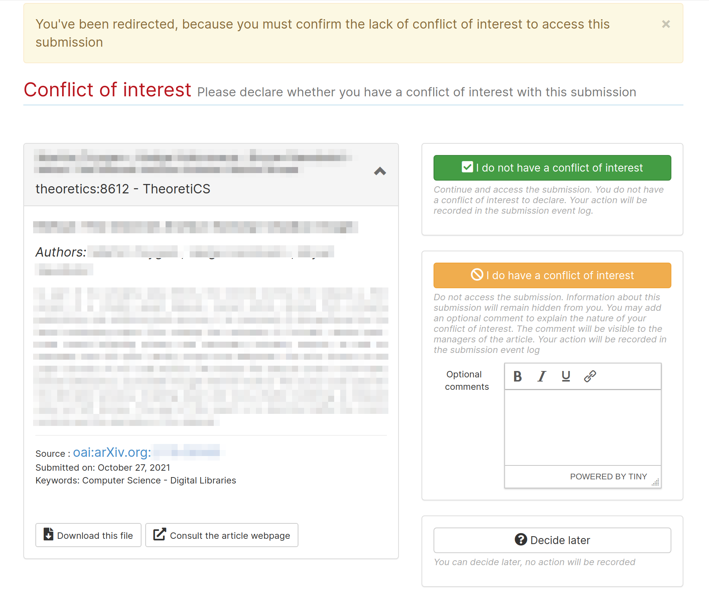

# TheoretiCS Helper for Editors

> Authors: Antoine Amarilli, Nathanaël Fijalkow

This document is intended for TheoretiCS editors to present the workflow of the
journal, which is a two-phase process. If you want a quick reference of the
workflow, have a look at the flowchart for [phase 1](editors-phase1.pdf) and [phase 2](editors-phase2.pdf).

## Some terminology and basic actions

A "rating" in Episciences jargon is a review

### Accessing papers

The two most important places are the "Dashboard" and the "Article management" pages.

* The "Dashboard" can be found from the menu on the left.
The "Journal management" tab includes statistics on all papers visible by you.
Clicking on "Manage articles" gets you to the "Article management" page.
The "My assigned papers" tab contains papers you were assigned to as editor.
The "My submissions" tab contains papers you submitted as author.
The "My account" tab lists all your privileges.

* The "Article management" page can be accessed either through the Dashboard or directly from the menu on the left: "Journal" expands into a list including "Article management".
This page lists all of the papers visible by you.
Click on a title to access the paper's page (the first time, you will have to declare whether you have a conflict of interest or not).

### Participating in the selection process

There are two ways editors can participate in the selection process of a paper:
* as assigned editors, either handling (main) or partner,
* as external editor, informed by the weekly digest

### Writing comments

The communication channel for discussing a paper is comments on the paper's page.
Once you access a paper, scroll down to "Editors comments" to see the comments and write one.

## Following the workflow

### Authors: submit an article

Authors first submit their work on a repository (HAL or arXiv), and then submit
the paper to the Episciences system.

Authors who do not wish to submit their work to a repository when submitting to
the journal must get in touch with the Editors in chief directly, so that their
paper can be handled outside the Episciences system.

Another case where the paper should be directly submitted to the
Editors in chief is for submissions which are in conflict with one of the
Editors in chief or managing editors (or directly done by them).

### Editors in chief: quickly evaluate

The Editors in chief can decide to reject the paper directly or to move it to Phase 1

### Editors in chief: assign handling and partner editors

The Editors in chief assign two editors: handling and partner.

### Editors: declare (absence of) conflict of interest

* Access the paper (see above)
* The first time you access a paper you have to declare whether you have a conflict of interest or not

### Assigned editors: invite reviewers

You should now assign reviewers. As long as the number of assigned reviewers is less than two, you will receive a reminder.

Scroll down to "Reviewers" and click on "Invite a reviewer" to invite a reviewer,
or to "Review this article" if you plan on reviewing it yourself.

There are you possibilities:
* Either the reviewer has already reviewed for TheoretiCS, select them from the list: "Filter reviewers"

* Or the reviewer has neve reviewed for TheoretiCS, click on "New reviewer" on the bottom right.
Please check whether the reviewer has an Episciences account by searching for them in "Invite a known user",
otherwise fill in the email / name / first name fields in "Invite a new user".

Once you have invited reviewers, the paper goes to status "Waiting for
reviewing". Once they are accepted invitations, the paper goes to status "Under
review". With these two last statuses, the paper is waiting for actions from the
reviewers (but you should make sure that the reviewers react). Once all
pending reviews are completed, the paper goes to status "Reviewed" and it
is up to you to propose a decision.

### Assigned editors: propose decision

Once the paper has status "Reviewed" and you do not wish any more reviews, you can propose a decision. 
For phase 1, this is: propose to accept or propose to reject (no revision possible).
Note that *technically* you could ask for revisions, but the TheoretiCS workflow discourages this to ensure quick feedback to the authors on Phase 1.

Once you have proposed a verdict, a weekly digest will invite all editors to comment on the article. 
Once this period has elapsed, the editors in chief communicate the decision to the authors.

During all that process, the paper remains in status "Reviewed".

### Editors in chief: communicate decision of Phase 1 to the authors

The Editors in chief send the reviews to the authors

### Assigned editors: take care of the review process for Phase 2

As previously, the paper goes to status "Waiting for reviewing" once reviewers have been invited, goes to "Under review" when invitations were accepted, and goes to "Reviewed" once the reviews are completed.

** NATH: I do not see where "reinvite reviewers automatically"????**

Once this process is finished, you can propose a decision. 
For phase 2, this is: propose to accept, propose to reject, ask for minor revisions, or ask for major revisions.

Revision requests are dealt with directly by you, without intervention from the Editors in chief.

Once you have proposed a final verdict (acceptance or rejection), a weekly digest will invite all
editors to comment on the article. Once this period has elapsed, the editors in chief communicate the decision to the authors.
